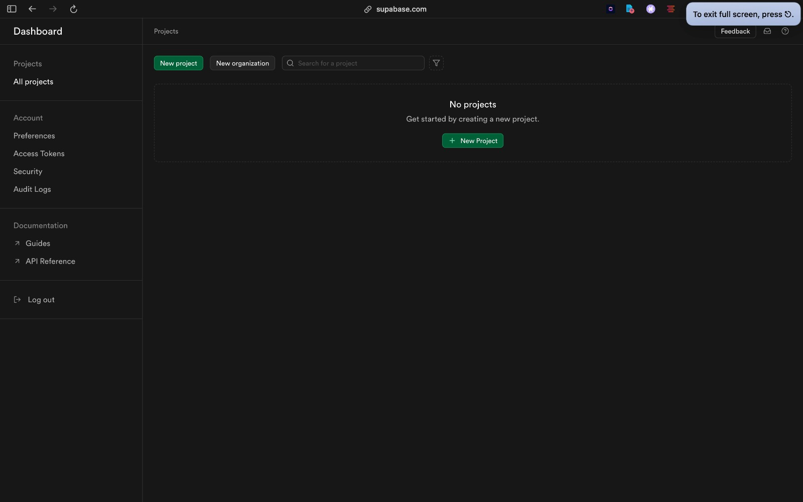
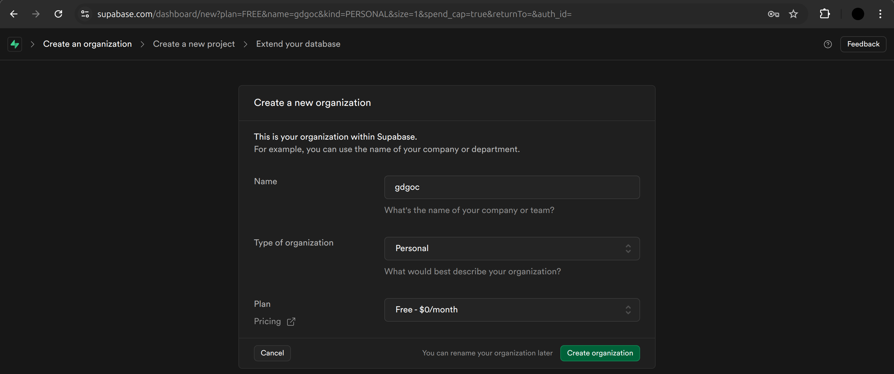
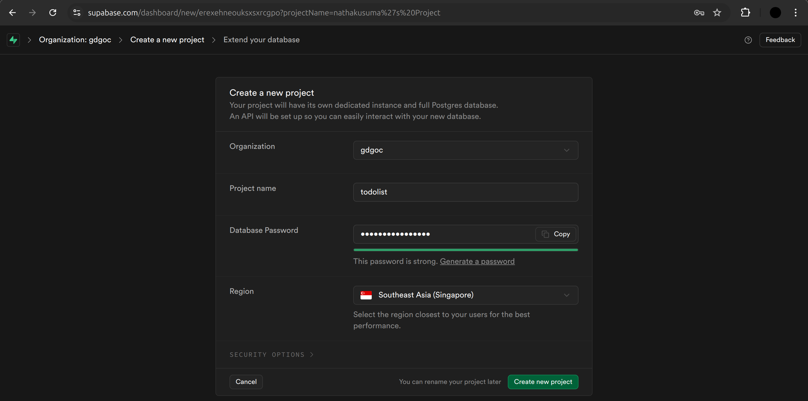
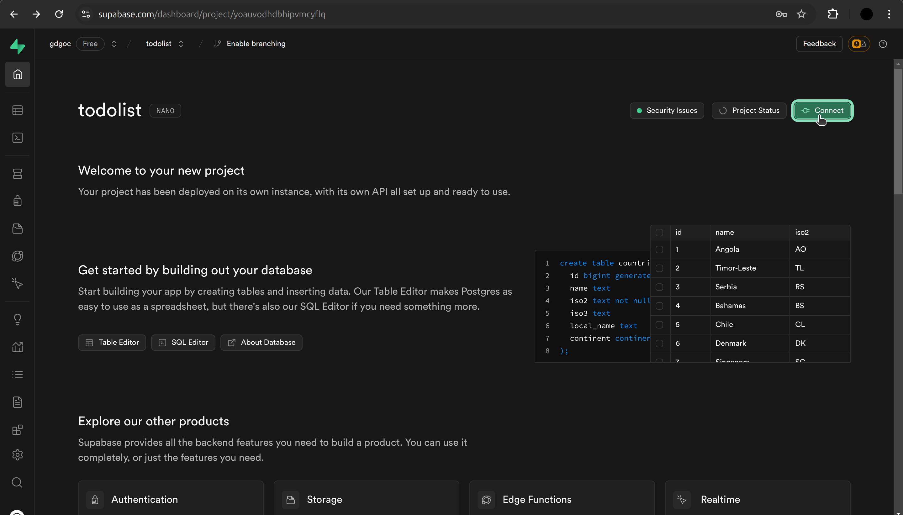
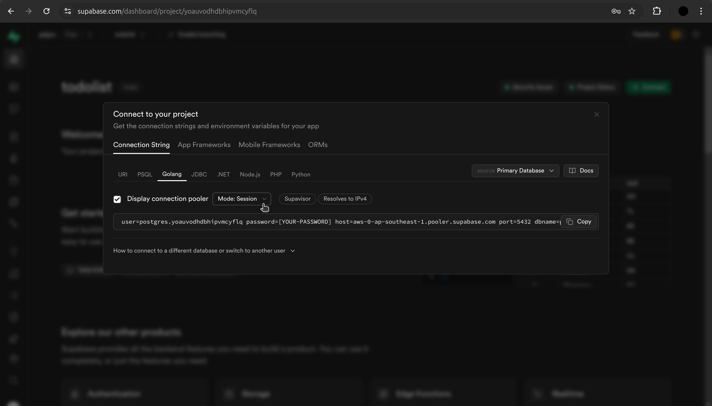
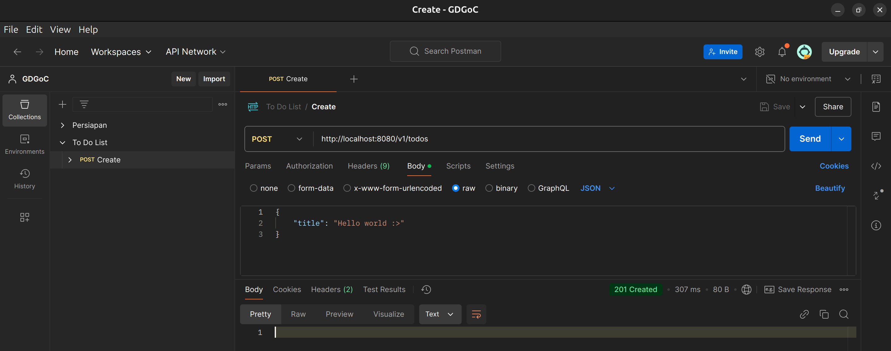
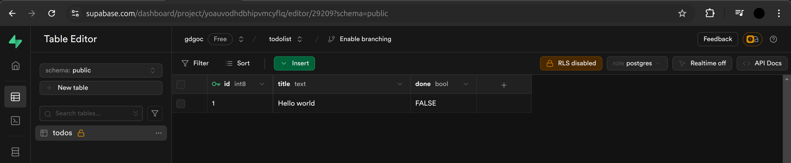

# Foundations of Backend Development with Golang

## **1. Introduction to Web Development**

Web development is the process of building websites or web applications that run on the internet or an intranet. Web development typically includes two main parts:

- **Frontend**: The part of the application users interact with directly (the interface). It includes HTML, CSS, JavaScript, and front-end frameworks like React, Angular, or Vue.js.

- **Backend**: The server-side logic, databases, and APIs that handle data processing, business logic, authentication, and storing/retrieving information. Backend is hidden from the user and communicates with the frontend.

## **2. What is Backend Web Development?**

Backend development refers to the server-side development of web applications. It focuses on the logic, databases, authentication, and data manipulation that occurs **behind the scenes**.

### Key Concepts

- **Server**: A server is a machine or software that handles client requests and provides resources (such as files, databases, etc.). It processes the requests, performs necessary actions, and sends the response back to the client.

- **Database**: Backend development often involves interacting with a database to store and retrieve data. Databases can be SQL (e.g., MySQL, PostgreSQL) or NoSQL (e.g., MongoDB). Databases store data that can be queried, updated, or deleted.

- **Business Logic**: This refers to the rules and processes that define how an application works. For example, calculating prices, validating user inputs, and performing complex tasks like image processing or sending emails.

- **Authentication and Authorization**: These are processes to ensure that users are who they say they are (authentication) and that they have permission to perform specific actions (authorization). This could involve methods like login systems, JWT tokens, OAuth, etc.

### Backend Technologies

- **Programming Languages**: Go, JavaScript, Python, Ruby, PHP, Java, and others.
- **Frameworks**: Frameworks help developers build applications quickly by providing tools and libraries for common tasks. Examples: Gin (Go), Fiber (Go), Express.js (Node.js), Laravel (PHP).
- **Databases**: Relational databases (SQL) store structured data in tables, whereas NoSQL databases store data in a more flexible format (JSON, key-value pairs, etc.).

## **3. Introduction to REST**

REST (Representational State Transfer) is an architectural style for designing networked applications. It is commonly used to design web APIs (Application Programming Interfaces) that allow communication between different systems, such as between a backend server and a frontend client.

### Key Principles of REST

1. **Statelessness**: Each request from a client to a server must contain all the information needed to understand the request. The server does not store any session state between requests.
2. **Client-Server Architecture**: The client (frontend) and server (backend) are independent entities that interact over a network. This separation allows for scalability and flexibility.
3. **Uniform Interface**: REST APIs use a standard set of operations to interact with resources. These operations are typically HTTP methods (GET, POST, PUT, DELETE) and use standard URIs (Uniform Resource Identifiers) to identify resources.
4. **Resource-Based**: In REST, everything is considered a resource (e.g., users, posts, products) and can be represented in formats like JSON or XML.
5. **Cacheability**: Responses should explicitly define whether they are cacheable, meaning that clients can reuse responses to avoid unnecessary requests.
6. **Code on Demand (Optional)**: Servers can send executable code to clients (e.g., JavaScript) to extend client functionality. This principle is optional and not commonly used in REST APIs.

### Common HTTP Methods

- **GET**: Retrieve information from the server. It does not modify any data.
- **POST**: Create a new resource on the server.
- **PUT**: Update an existing resource or create a new one if it does not exist.
- **DELETE**: Delete a resource.
- **PATCH**: Partially update an existing resource.

Others: HEAD, CONNECT, OPTIONS, TRACE.

## **4. RESTful API Design**

Designing a REST API means creating a set of endpoints that allow clients to perform CRUD (Create, Read, Update, Delete) operations on resources.

### RESTful Endpoint Structure

- An endpoint is a URL that points to a resource. For example, `https://api.example.com/users` might represent the collection of all users.
- **Example Endpoints**:
  - `GET /users`: Retrieve a list of all users.
  - `GET /users/123`: Retrieve information about a specific user with ID 123.
  - `POST /users`: Create a new user.
  - `PUT /users/123`: Update information for user 123.
  - `DELETE /users/123`: Delete user 123.

### Good Practices for RESTful API Design

1. **Use Plural Nouns**: Use plural names for collections (e.g., `/users`, `/products`).
2. **Use HTTP Status Codes**: The status code in the HTTP response tells the client whether the request was successful or encountered an error.
   - `200 OK`: Request was successful.
   - `201 Created`: Resource was created successfully.
   - `400 Bad Request`: The request was invalid.
   - `404 Not Found`: The requested resource was not found.
   - `500 Internal Server Error`: An error occurred on the server side.
3. **Versioning**: APIs should be versioned to allow for future changes without breaking existing functionality. This can be done in the URL, e.g., `/v1/users`.
4. and many more...

### Request and Response Flow

1. **Request**: The client sends an HTTP request with a specific method (GET, POST, etc.) to a REST endpoint.
2. **Processing**: The server processes the request, interacts with the database or other services, and applies any necessary business logic.
3. **Response**: The server sends an HTTP response with data (e.g., JSON) and an appropriate status code to the client.

## **5. HTTP & Web Servers**

Web servers are responsible for receiving HTTP requests from clients (usually browsers or other applications) and responding with HTTP responses. They act as intermediaries between the client and the backend logic of the web application.

### Key Concepts

- **HTTP Protocol**: HyperText Transfer Protocol (HTTP) is the foundation of communication on the web. It is a request-response protocol between the client (e.g., browser) and the server.
  
- **Web Server**: A web server, like Apache, Nginx, Go web server (using the `net/http` package), is responsible for handling incoming requests from the client, routing them to the appropriate backend logic, and sending back responses.

- **Routing**: Routing refers to the process of determining which backend logic (i.e., code or function) should handle a particular request based on the URL, HTTP method, and other factors.

- **Middleware**: Middleware are functions or modules that sit between the server and the final request handler. They can be used for tasks such as logging, authentication, validation, and more.

## **6. Authentication and Security in Backend Development**

Authentication and security are crucial in backend development to ensure that only authorized users can access specific resources.

### Authentication Methods

- **Session-Based Authentication**: A user logs in with their credentials, and the server stores a session ID in memory or a cookie. Each subsequent request includes this session ID to verify the user's identity.
  
- **Token-Based Authentication**: A more modern approach, often using **JSON Web Tokens (JWT)**. When a user logs in, the server generates a token and sends it to the client. The client includes this token in subsequent requests, allowing the server to verify the user’s identity without storing any session data.

### Common Security Concerns

- **SQL Injection**: A type of attack where malicious SQL code is injected into the database query. Prevented using prepared statements or ORM libraries.
- **Cross-Site Scripting (XSS)**: A type of attack where an attacker injects malicious scripts into web pages. Prevented by sanitizing inputs.
- **Cross-Site Request Forgery (CSRF)**: An attack where unauthorized commands are sent from a user’s browser. Prevented using anti-CSRF tokens.
- **Encryption**: Using HTTPS (SSL/TLS) to encrypt data between the client and the server to ensure confidentiality and data integrity.

## **7. Building a to do list REST API with Go**

### 7.1 Prerequisites

Before we start, do this prerequisite:

[Install Go](https://go.dev/doc/install)

Go is a statically typed, compiled programming language by Google. It is known for its simplicity, performance, and concurrency support.

[Create Postman Account](https://identity.getpostman.com/signup)

[Install Postman](https://www.postman.com/downloads)

Postman is a popular API client that allows you to test and debug APIs.

[Create a Supabase Account](https://supabase.com/dashboard/sign-up)

We use firebase for online & managed PostgreSQL database.

### 7.2 Project Setup

#### 7.2.1. **Create a New Go Module**: Initialize a new Go module to manage dependencies

Create a new directory for your project and run the following command:

```bash
go mod init github.com/your-username/todolist-backend
```

Replace `your-username` with your GitHub username or any other username.

#### 7.2.2. **Install Required Packages**: Install the necessary packages for our project

In your project directory, run the following commands to install the required packages:

```bash
go get -u github.com/gin-gonic/gin
```

Gin is a popular web framework for Go.

```bash
go get -u github.com/joho/godotenv
```

Godotenv loads environment variables from a `.env` file.
  
```bash
go get -u gorm.io/gorm
```

GORM is an ORM (Object-Relational Mapping) library for Go. It simplifies database operations by mapping Go structs to database tables.
  
```bash
go get -u gorm.io/driver/postgres
```

The PostgreSQL driver for GORM. We will use PostgreSQL as our database.

#### 7.2.3. **Project Structure**

This is the project structure for our backend application. It is designed for simplicity and to help you get started quickly while implementing common practices and clean architecture, ensuring separation of concerns and maintainability.

You can create the files and directories now or as we progress through the tutorial.

```text
todolist-backend/
├── cmd/
│   └── app/
│       └── main.go
├── internal/
│   └── app/
│   │   ├── dto/
│   │   │   └── todo_dto.go
│   │   ├── entity/
│   │   │   └── todo.go
│   │   ├── handler/
│   │   │   └── todo_handler.go
│   │   ├── repository/
│   │   │   └── todo_repository.go
│   │   └── service/
│   │       └── todo_service.go
│   │
│   └── pkg/
│       ├── database/
│       │   └── postgres.go
│       └── response/
│           └── error.go
├── .env
├── go.mod
└── go.sum
```

### 7.2.4. Database Setup

We will use Supabase, a managed PostgreSQL database, for our project.

Create a new project:



If you don't have an organization, Supabase will prompt you to create one.



Once you have created an organization, you can create a new project:



For the database password, I suggest you to use generated password by clicking the "Generate a password" button. Do NOT use your own password, because this password will be stored in the project's file.

After creating the project, wait for a few seconds, and you will be redirected to the project dashboard.

Click "Connect":



In the "Connection String" tab, select "Golang" tab, then select "Mode: Session" from the dropdown, and copy the connection string:



### 7.3. Create simple endpoint

Write this in `cmd/app/main.go`:

```go
package main

import (
	"github.com/gin-gonic/gin"
)

func main() {
	r := gin.Default()
	r.GET("/ping", func(c *gin.Context) {
		c.JSON(200, gin.H{
			"message": "pong",
		})
	})

	r.Run(":8080")
}
```

> [!NOTE]
> If you encounter this error:
>
> ```text
> [GIN-debug] [ERROR] listen tcp :8080: bind: permission denied
> ```
>
> It means that the port 8080 is already used by other application in your machine. Try use another number as your port (edit this part: `r.Run(":8080")`). Port can range from 1 to 65535.

Run the application:

```bash
go run cmd/app/main.go
```

> [!NOTE]
> To stop the application, press `Ctrl + C` (`Cmd + C` for mac) in the terminal.

### 7.4. Environment variables

Without environment variables, every change on the port number and other configurations later will require you to change the code and recompile the application. This is not a good practice.

Enviroment variables are used to store configurations that can be changed without recompiling the application. It also helps to keep sensitive information (like database credentials) secure.

Create a new file named `.env` in the root directory of your project and add the following content:

```text
APP_PORT=8080
```

Add this code to the start of main function in `cmd/app/main.go`:

```go
if err := godotenv.Load(); err != nil {
	log.Fatalln("Error loading .env file: ", err)
}
```

Replace the port number in `r.Run(":8080")` with the environment variable:

```go
r.Run(":" + os.Getenv("APP_PORT"))
```

Your `cmd/app/main.go` should now look like this:

```go
package main

import (
	"github.com/gin-gonic/gin"
	"github.com/joho/godotenv"
	"log"
	"os"
)

func main() {
	if err := godotenv.Load(); err != nil {
		log.Fatalln("Error loading .env file: ", err)
	}
	
	r := gin.Default()
	r.GET("/ping", func(c *gin.Context) {
		c.JSON(200, gin.H{
			"message": "pong",
		})
	})

	r.Run(":" + os.Getenv("APP_PORT"))
}
```

Re-run the application to ensure that the environment variable is loaded correctly.

### 7.5. Database Connection

Create a new file `postgres.go` inside `internal/pkg/database/` directory. Add the following code to establish a connection to the PostgreSQL database:

```go
package database

import (
	"fmt"
	"gorm.io/driver/postgres"
	"gorm.io/gorm"
	"log"
	"os"
)

func autoMigrate(db *gorm.DB) error {
	return db.AutoMigrate(
		//TODO: add entities here
	)
}

func NewPostgresDB() *gorm.DB {
	dsn := fmt.Sprintf("host=%s user=%s password=%s dbname=%s port=%s",
		os.Getenv("POSTGRES_HOST"),
		os.Getenv("POSTGRES_USER"),
		os.Getenv("POSTGRES_PASSWORD"),
		os.Getenv("POSTGRES_DB"),
		os.Getenv("POSTGRES_PORT"),
	)
	db, err := gorm.Open(postgres.Open(dsn))
	if err != nil {
		log.Fatalln("Error connecting to database: ", err)
		return nil
	}

	if err := autoMigrate(db); err != nil {
		log.Fatalln("Error migrating database: ", err)
		return nil
	}

	return db
}
```

`NewPostgresDB` function constructs the database connection string (dsn) using environment variables, and then opens a connection to the PostgreSQL database using GORM. If the connection is successful, it returns the database instance. If there is an error, it logs the error and forces the app to exit. It also calls the `autoMigrate` function.

`autoMigrate` function is used to automatically create database tables based on the entity structs. We will add the entity structs later in the tutorial.

Add the following environment variables to your `.env` file:

```text
POSTGRES_HOST=your-host
POSTGRES_USER=your-username
POSTGRES_PASSWORD=your-password
POSTGRES_DB=your-database
POSTGRES_PORT=your-port
```

Replace `your-host`, `your-username`, `your-password`, `your-database`, and `your-port` with your PostgreSQL database details. Extract it from the connection string you copied from Supabase:


Your `.env` file should look like this:

```text
APP_PORT=8080

POSTGRES_HOST=your-host
POSTGRES_USER=your-username
POSTGRES_PASSWORD=your-password
POSTGRES_DB=your-database
POSTGRES_PORT=your-port
```

In the `cmd/app/main.go` file, call the `NewPostgresDB` function to establish a connection to the database:

```go
_ = database.NewPostgresDB()
```

For now, we are ignoring the return value of the `NewPostgresDB` function by assigning it to `_`. We will handle database operations in the subsequent sections.

Your `cmd/app/main.go` file should now look like this:

```go
package main

import (
	"github.com/gdgc-ub/web-todolist-backend-informal/internal/pkg/database"
	"github.com/gin-gonic/gin"
	"github.com/joho/godotenv"
	"log"
	"os"
)

func main() {
	if err := godotenv.Load(); err != nil {
		log.Fatalln("Error loading .env file: ", err)
	}

	_ = database.NewPostgresDB()
	
	r := gin.Default()
	r.GET("/ping", func(c *gin.Context) {
		c.JSON(200, gin.H{
			"message": "pong",
		})
	})

	r.Run(":" + os.Getenv("APP_PORT"))
}
```

Re-run the application to ensure that the database connection is established successfully.

> [!NOTE]
> If you encounter an error, most likely it is due to incorrect database credentials or connection details. Double-check the environment variables in the `.env` file and ensure that they match your PostgreSQL database configuration.

### 7.6. Error Response Handling

Create a new file `error.go` inside `internal/pkg/response/` directory, and add the following code:

```go
package response

type ErrorResponse struct {
	Code    int    `json:"-"`
	Message string `json:"error"`
}

func NewErrorResponse(code int, message string) *ErrorResponse {
	return &ErrorResponse{Code: code, Message: message}
}

func (r *ErrorResponse) Error() string {
	return r.Message
}
```

**Why do we need custom error?**

- **Consistency**: By using a custom error type, we can ensure that all errors returned by our API have a consistent structure.
- **HTTP Status Code**: Regular errors in Go just contain the error message and do not include the HTTP status code. By using a custom error type, we can associate an error code with each error.

**ErrorResponse Struct**: This is a custom error type that holds an error code and a message.

- `Code`: An integer representing the HTTP status code of the error. The `json:"-"` tag indicates that this field should be ignored when marshaling/unmarshaling JSON data.
- `Message`: A string containing the error message. The `json:"error"` tag specifies the field name when marshaling/unmarshaling JSON data.

**Error Method**: This method makes `ErrorResponse` **implement the error interface** in Go. The error interface requires a single method, `Error() string`, which returns the error message.

- `Error() string`: This method returns the `Message` field of the `ErrorResponse` struct.

### 7.7. Create Todo

#### 7.7.1. Define the Todo Entity

Create a new file `todo.go` inside `internal/app/entity/` directory, and add the following code:

```go
package entity

type Todo struct {
	ID    uint   `json:"id"`
	Title string `json:"title"`
	Done  bool   `json:"done"`
}
```

This struct represents a Todo entity with three fields: `ID`, `Title`, and `Done`. The `json` tags are used to specify the field names when marshaling/unmarshaling JSON data.

#### 7.7.2. Define the Todo DTO

DTO (Data Transfer Object) is an object that carries data between processes. It is used to encapsulate data and send it from one layer of the application to another. Here, we also use DTO as a representation of the data received from the client.

With Gin, we can bind the request to the DTO automatically. It also can validate the request data based on the `binding` struct tags.

Create a new file `todo_dto.go` inside `internal/app/dto/` directory, and add the following code:

```go
package dto

type CreateTodoRequest struct {
	Title string `json:"title" binding:"required,min=1,max=255"`
}
```

This struct represents the request data for creating a new Todo. It contains a single field `Title` with the `json` tag for specifying the field name in JSON data and the `binding` tag for validation. The binding tag properties is pretty self-explanatory, and you can explore more about it in the [go-playground/validator documentation](https://pkg.go.dev/github.com/go-playground/validator/v10).

#### 7.7.3. Repository

The repository pattern is used to separate the data access logic from the rest of the application. It provides an abstraction layer for data operations, making it easier to switch between different data sources or databases.

Create a new file `todo_repository.go` inside `internal/app/repository/` directory, and add the following code:

```go
package repository

import (
	"github.com/gdgc-ub/web-todolist-backend-informal/internal/app/entity"
	"gorm.io/gorm"
)

type TodoRepository struct {
	db *gorm.DB
}

func NewTodoRepository(db *gorm.DB) *TodoRepository {
	return &TodoRepository{db}
}

func (r *TodoRepository) Create(title string) error {
	return r.db.Create(&entity.Todo{Title: title}).Error
}
```

TodoRepository struct represents the repository for Todo entities. It contains a single field `db` of type `*gorm.DB`, which is the database instance. All data operations related to Todo entities are defined as methods of this struct.

NewTodoRepository function is a constructor for creating a new TodoRepository instance. It takes a database instance as a parameter and returns a pointer to the TodoRepository struct.

Then, we create a method `Create` to insert a new Todo entity into the database. `(r *TodoRepository)` is the receiver of the method, which allows us to call this method on a TodoRepository instance.

Our `Create` method takes the title of the Todo as a parameter and returns an error. The method uses the GORM Create function to insert a new record into the database. GORM's `Create` method takes the entity struct as a parameter and creates a new record in the database based on the struct fields.

You can learn more about GORM's Create method in the [official documentation](https://gorm.io/docs/create.html).

#### 7.7.4. Service

The service layer contains the business logic of the application. It coordinates data operations between the repository and the handler, applies business rules, and performs any necessary processing.

Create a new file `todo_service.go` inside `internal/app/service/` directory, and add the following code:

```go
package service

import (
	"github.com/gdgc-ub/web-todolist-backend-informal/internal/app/dto"
	"github.com/gdgc-ub/web-todolist-backend-informal/internal/app/repository"
	"github.com/gdgc-ub/web-todolist-backend-informal/internal/pkg/response"
	"log"
	"net/http"
)

type TodoService struct {
	r *repository.TodoRepository
}

func NewTodoService(r *repository.TodoRepository) *TodoService {
	return &TodoService{r}
}

func (s *TodoService) Create(title string) error {
	if err := s.r.Create(title); err != nil {
		log.Println("Error creating todo: ", err)
		return response.NewErrorResponse(http.StatusInternalServerError, "something went wrong")
	}

	return nil
}
```

TodoService struct represents the service layer for Todo entities. It contains a single field `r` of type `*repository.TodoRepository`, which is the repository instance. All business logic related to Todo entities is defined as methods of this struct.

NewTodoService function is a constructor for creating a new TodoService instance. It takes a repository instance as a parameter and returns a pointer to the TodoService struct.

Create a method `Create` to handle the creation of a new Todo entity. There's not much business logic in this method, but it acts as a coordinator between the repository and the handler.

If the `Create` method in the repository layer returns an error, the service layer logs the error and returns an error response with the custom error type we defined earlier, containing HTTP Status 500 (Internal Server Error) and an error message "something went wrong". It is important to not return the actual (raw) error message to the client for security reasons.

#### 7.7.5. Handler

The handler layer is responsible for handling HTTP requests, parsing request data, calling the service layer, and returning responses to the client.

Create a new file `todo_handler.go` inside `internal/app/handler/` directory, and add the following code:

```go
package handler

import (
	"errors"
	"github.com/gdgc-ub/web-todolist-backend-informal/internal/app/dto"
	"github.com/gdgc-ub/web-todolist-backend-informal/internal/app/service"
	"github.com/gdgc-ub/web-todolist-backend-informal/internal/pkg/response"
	"github.com/gin-gonic/gin"
	"net/http"
)

type TodoHandler struct {
	s *service.TodoService
}

func NewTodoHandler(s *service.TodoService) *TodoHandler {
	return &TodoHandler{s}
}

func (h *TodoHandler) Create() gin.HandlerFunc {
	return func(c *gin.Context) {
		var req dto.CreateTodoRequest
		if err := c.ShouldBindJSON(&req); err != nil {
			c.JSON(http.StatusBadRequest, gin.H{"error": err.Error()})
			return
		}

		if err := h.s.Create(req.Title); err != nil {
			var errResp *response.ErrorResponse
			errors.As(err, &errResp)
			c.JSON(errResp.Code, errResp)
			return
		}

		c.Status(http.StatusCreated)
	}
}
```

TodoHandler struct represents the handler for Todo entities. It contains a single field `s` of type `*service.TodoService`, which is the service instance. All request handling logic related to Todo entities is defined as methods of this struct.

Create a method `Create` to handle the creation of a new Todo entity. This method should return a `gin.HandlerFunc`.

`gin.HandlerFunc` is a function that takes a `*gin.Context` as a parameter and returns nothing (`func(c *gin.Context)`). It is used to define route handlers in Gin. That's why we're returning `func(c *gin.Context)` function in the `Create` method.

You can learn more about Gin in the [Gin's official documentation](https://gin-gonic.com/docs).

In the `Create` method, we first bind the request data to the `CreateTodoRequest` DTO using `c.ShouldBindJSON(&req)`. The `ShouldBindJSON` method also validates the request based on the `binding` tag we talked earlier. If there is an error during binding (e.g., invalid JSON data), we return a Bad Request response with the error message.

If the binding is successful, we call the `Create` method of the service layer to create a new Todo entity. If the service layer returns an error, we cast the error as type `*response.ErrorResponse` (assuming all errors coming from service layer are our custom error) and return the error response to the client with the appropriate status code.

Finally, if the Todo entity is created successfully, we return a Created response with status code 201.

#### 7.7.6. Register the Create Todo Handler

In the `cmd/app/main.go` file, register the Create Todo handler by adding the following code after the database connection and before the `r.Run` function:

```go
todoRepository := repository.NewTodoRepository(db)
todoService := service.NewTodoService(todoRepository)
todoHandler := handler.NewTodoHandler(todoService)

v1 := r.Group("/v1")

v1.POST("/todos", todoHandler.Create())
```

This code creates instances of the Todo repository, service, and handler, and then registers the Create Todo handler to handle POST requests to the `/v1/todos` endpoint.

> [!NOTE]
> `/v1` is a common practice to version APIs. It allows you to make changes to the API without breaking existing clients. You can add new versions (e.g., `/v2`) as needed.

Your `cmd/app/main.go` file should now look like this:

```go
package main

import (
	"github.com/gdgc-ub/web-todolist-backend-informal/internal/app/handler"
	"github.com/gdgc-ub/web-todolist-backend-informal/internal/app/repository"
	"github.com/gdgc-ub/web-todolist-backend-informal/internal/app/service"
	"github.com/gdgc-ub/web-todolist-backend-informal/internal/pkg/database"
	"github.com/gin-gonic/gin"
	"github.com/joho/godotenv"
	"log"
	"os"
)

func main() {
	if err := godotenv.Load(); err != nil {
		log.Fatalln("Error loading .env file: ", err)
	}

	db := database.NewPostgresDB()

	r := gin.Default()
	r.GET("/ping", func(c *gin.Context) {
		c.JSON(200, gin.H{
			"message": "pong",
		})
	})

	todoRepository := repository.NewTodoRepository(db)
	todoService := service.NewTodoService(todoRepository)
	todoHandler := handler.NewTodoHandler(todoService)

	v1 := r.Group("/v1")

	v1.POST("/todos", todoHandler.Create())

	r.Run(":" + os.Getenv("APP_PORT"))
}
```

Re-run the application to ensure that the Create Todo handler is registered correctly.

### 7.7.7. Test the Create Todo Endpoint

Now that we have implemented the Create Todo endpoint, let's test it using Postman.

1. Open Postman and create a new request.
2. Set the request method to POST.
3. Enter the request URL: `http://localhost:8080/v1/todos`.
4. Set the request body to JSON format:

```json
{
	"title": "Hello world"
}
```

5. Click the Send button to make the request.
6. You should receive a response with status code 201 (Created).



7. Take a look at the database to verify that the Todo entity has been created successfully.


